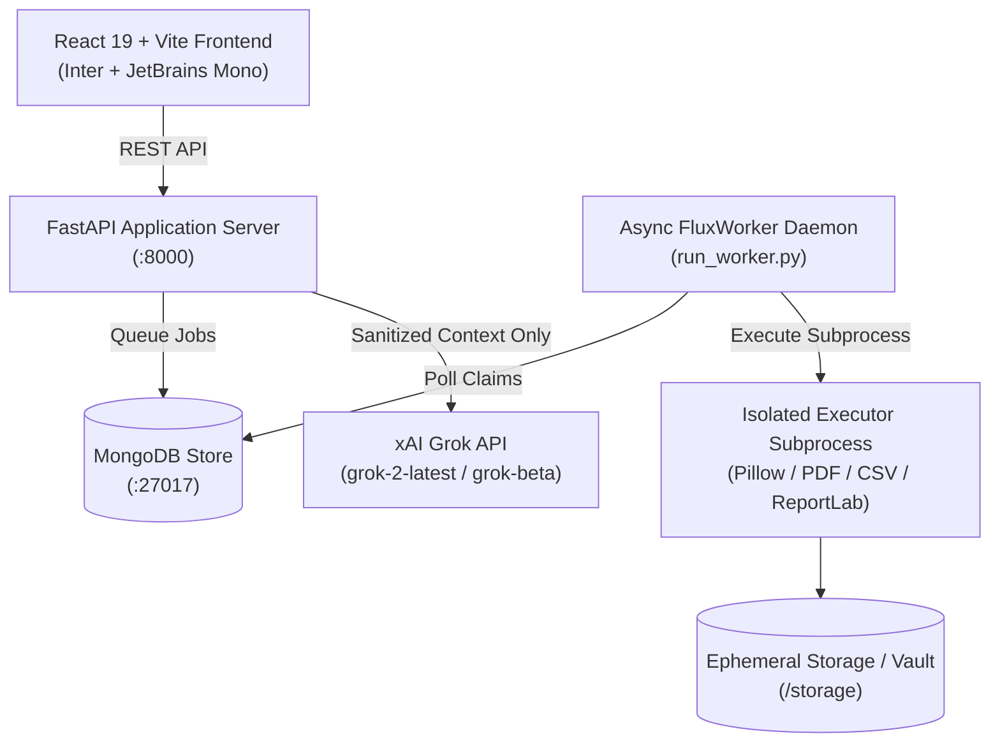

# FluxDrive — Privacy-First File Workstation & Transformation Engine

<div align="center">

**Your Files. Your Control.**  
*A sentinel-level, ephemeral desktop workstation for converting, inspecting, and protecting sensitive files inside an isolated, autonomous privacy-first sandbox.*

[](https://fastapi.tiangolo.com/)
[](https://react.dev/)
[](https://tailwindcss.com/)
[](https://x.ai/)
[](https://www.mongodb.com/)
[](LICENSE)

</div>

---

## ✦ Overview

FluxDrive is a modern desktop-grade file processing workstation designed specifically for sensitive documents, images, and data files. Built from the ground up on zero-trust principles, FluxDrive provides:

- **Isolated Format Conversion:** Safe rasterization, compilation, and serialization pipelines running in sandboxed execution subprocesses.
- **Autonomous Ephemeral Vault:** Files exist exclusively inside configurable TTL countdown memory (5 to 15 minutes) before undergoing automated cryptographic shredding.
- **AI Privacy Firewall with xAI Grok:** Document intelligence strictly gated by an air-gapped firewall. Raw files are **never** transmitted to external models; only sanitised, PII-masked context is passed to **xAI Grok** upon explicit user consent.
- **Security Passport & Tamper-Proof Audit:** Every transformation produces an immutable forensic passport detailing SHA-256 hashes, byte deltas, EXIF sanitisation, and HMAC-SHA256 download authorizations.
- **Sentinel-Level Editorial Interface:** A distraction-free desktop experience pairing **Inter** typography with **JetBrains Mono** telemetry on an off-white canvas.

---

## ✦ Key Features

### 1. Ephemeral Vault & Automated Shredder
- Files held in temporary isolated storage with strict lifecycle governance:
  - `STANDARD`: 15-minute TTL
  - `PRIVATE`: 10-minute TTL (automatic metadata purge)
  - `MAXIMUM`: 5-minute TTL (strict airgap, instant shredding)
- Background cleanup daemon actively shreds expired artifacts using multi-pass zero-byte overwriting.

### 2. Isolated Format Transformation Engine
- **Images:** Lossless and perceptual quality-tuned conversions (`JPG ⇄ PNG`, `PNG ⇄ WEBP`, `WEBP ⇄ JPG`).
- **Batch-to-PDF:** Combine multiple images into standardized, high-fidelity vector PDF documents.
- **PDF Extraction:** Rasterize document pages into standalone PNG or JPG images at 150 DPI resolution.
- **Tabular Data:** Bidirectional conversion between structured CSV rows and JSON records.
- **Metadata Scrubbing:** Forensic sanitisation of GPS tags, camera serial numbers, and device fingerprints.

### 3. AI Privacy Firewall & xAI Grok Copilot
- Powered by **xAI Grok (`grok-2-latest` / `grok-beta`)**:
  - Explains complex files, contracts, and data sheets.
  - Summarizes content into key bullet points.
  - Detects privacy vulnerabilities and recommends remediation.
- **Guaranteed Zero Raw File Exposure:**
  1. Raw binary files are **blocked**.
  2. PII tokens (SSN, credit cards, emails, phone numbers) are masked using regex + Luhn verification.
  3. Interactive Sanitised Payload Preview allows users to inspect exactly what will be sent before granting permission.
  4. Configurable via `.env` (`GROK_API_KEY`) or directly inside the application settings.

### 4. Security Passport & Cryptographic Integrity
- Generates a verifiable **Security Passport** for every staged or transformed file:
  - Pre- and post-transformation SHA-256 verification.
  - PII risk scoring and EXIF tag analysis.
  - Ephemeral HMAC-SHA256 signed download tokens (preventing URL enumeration or replay attacks).

---

## ✦ System Architecture



---

## ✦ Supported Conversion Matrix

| Source Format | Target Format | Pipeline Operation | Description |
| :--- | :--- | :--- | :--- |
| **PNG** | JPG | `png_to_jpg` | Flattens transparent alpha onto white background |
| **PNG** | WEBP | `png_to_webp` | Modern web compression with high visual fidelity |
| **JPG** | PNG | `jpg_to_png` | Lossless raster expansion for precision editing |
| **JPG** | WEBP | `jpg_to_webp` | Footprint minimization preserving edge sharpness |
| **WEBP** | PNG / JPG | `webp_to_*` | Universal raster decoding |
| **Images** | PDF | `batch_to_pdf` | Compiles multiple images into multi-page PDF |
| **PDF** | PNG / JPG | `pdf_to_*` | High-fidelity 150 DPI page extraction |
| **CSV** | JSON | `csv_to_json` | Parses tabular rows into structured JSON |
| **JSON** | CSV | `json_to_csv` | Normalizes nested JSON into flat comma-separated values |
| **DOCX** | PDF | `docx_to_pdf` | Compiles Microsoft Word documents into vector PDF |
| **Any Image** | Lossless | `compress_image` | Byte-level stream optimization |
| **Any Image** | Clean | `strip_metadata` | Forensically strips EXIF, GPS, and device tags |

---

## ✦ Getting Started

### Prerequisites
- **Python 3.10+**
- **Node.js 18+** & **npm**
- **MongoDB** running locally on port `27017` (or remote MongoDB URI)

---

### Installation

#### 1. Clone the repository
```bash
git clone https://github.com/alankolett/FluxDrive.git
cd FluxDrive
```

#### 2. Configure Environment
Copy the example environment file:
```bash
cp .env.example .env
```
Edit `.env` and add your **xAI Grok API Key**:
```env
GROK_API_KEY=xai-your-api-key-here
GROK_MODEL=grok-2-latest
MONGO_URI=mongodb://localhost:27017
DB_NAME=fluxdrive
```
*(Note: You can also configure your Grok API key directly within the app UI under **AI Copilot** or **Settings**).*

#### 3. Setup Backend
```bash
python -m venv .venv
# On Windows:
.venv\Scripts\activate
# On Linux/macOS:
source .venv/bin/activate

pip install -r backend/requirements.txt
```

#### 4. Setup Frontend
```bash
cd frontend
npm install
cd ..
```

---

### Running FluxDrive

You can launch all services with a single command:

**On Windows (PowerShell):**
```powershell
.\run_fluxdrive.ps1
```

**Or launch components individually:**

1. **FastAPI Backend Server:**
   ```bash
   python -m uvicorn backend.app.main:app --host 127.0.0.1 --port 8000 --reload
   ```

2. **Async Conversion Worker Daemon:**
   ```bash
   python backend/run_worker.py
   ```

3. **Vite Frontend Dev Server:**
   ```bash
   cd frontend
   npm run dev
   ```

Open your browser at **`http://localhost:5173`**.

---

## ✦ End-to-End Test Suite

FluxDrive includes a full live end-to-end integration test validating file upload, worker queue claiming, sandboxed conversion execution, signed HMAC download token generation, Security Passport creation, and automated shredding:

```bash
python backend/test_api_e2e.py
```

Expected output:
```text
Testing live API on http://127.0.0.1:8000
  [PASS] Health check: FluxDrive - healthy
  [PASS] Upload verified. File ID: ... Allowed Ops: [...]
  [PASS] Job submitted to queue. Job ID: job_...
  [PASS] Worker claimed and COMPLETED job. Output: test_e2e_image.jpg Size: 436 bytes
  [PASS] Signed download verified. Downloaded 436 bytes with verified HMAC signature
  [PASS] Security Passport generated: VERIFIED-SAFE | SHA-256: ...
  [PASS] Vault contains ephemeral files with live expiry countdowns
  [PASS] Immediate file destruction verified

All Live End-to-End API tests PASSED successfully!
```

---

## ✦ Security & Privacy Philosophy

1. **Ephemeral by Default:** FluxDrive is a workbench, not cold storage. Every file is ephemeral and automatically shredded.
2. **Subprocess Isolation:** Conversion workers execute inside isolated subprocesses with timeouts and strict execution boundaries.
3. **No Raw Data to External AI:** External AI models only ever receive scrubbed text buffers where all PII has been replaced with cryptographic masks.
4. **Zero Telemetry Leakage:** No internal server IP addresses, database strings, or stack traces are ever exposed to the client.

---

## ✦ License

This project is licensed under the [MIT License](LICENSE).
